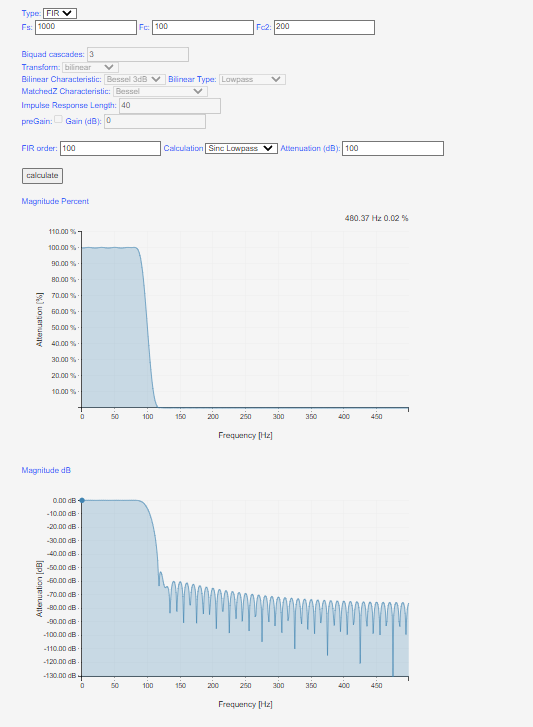
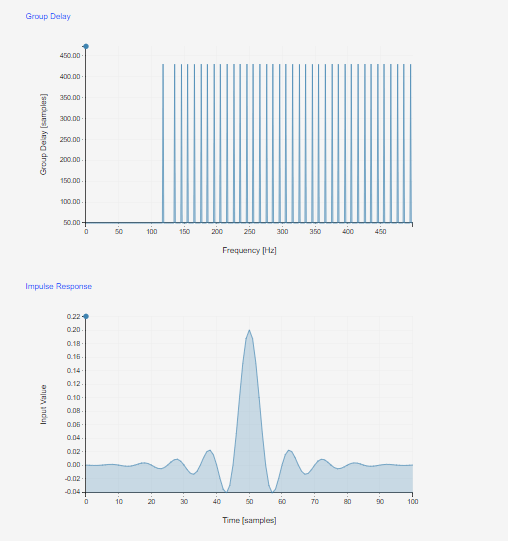
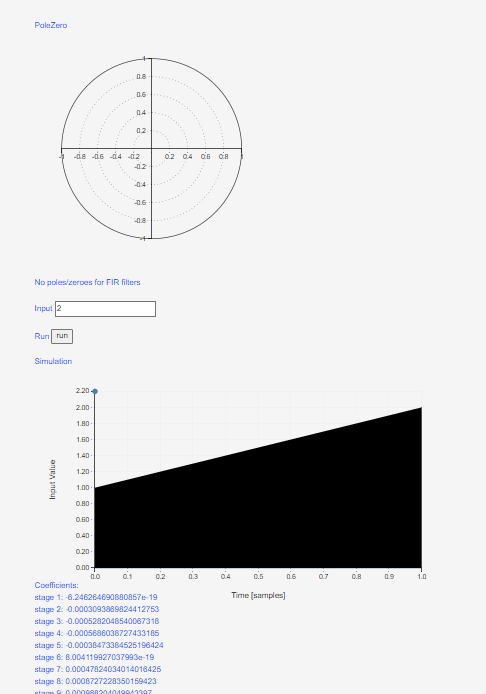
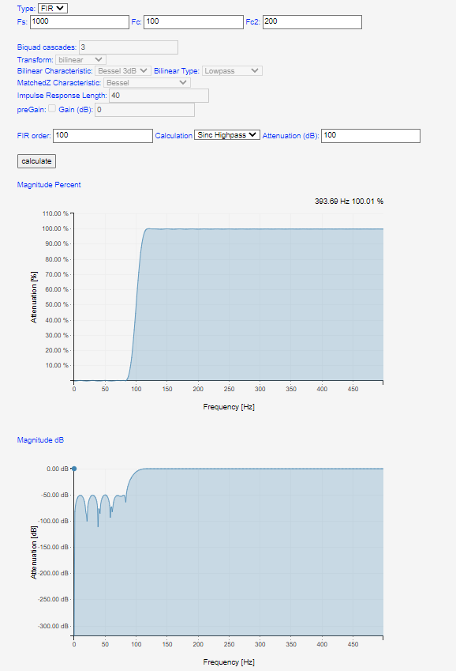
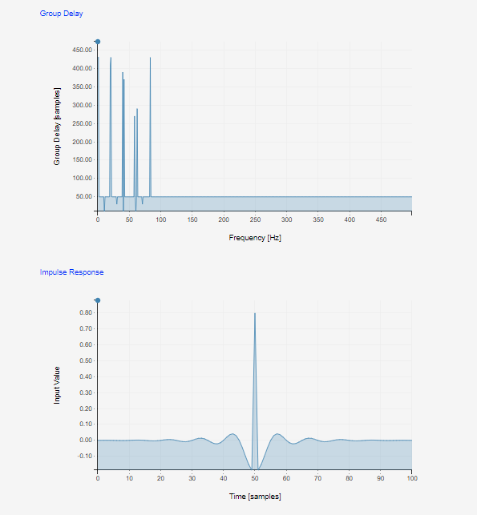
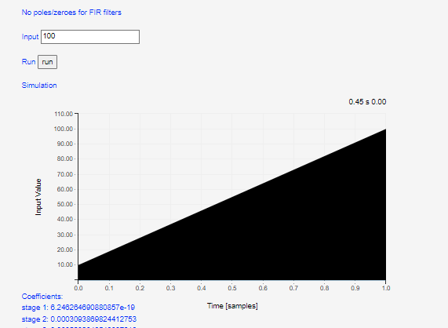

## Procedure

1. Click on the Experiment tab SIMULATOR will open the workspace
                              
2. Read the instruction to understand how the simulation to be executed.

3. Select FIR from Type and select Calculation as Lowpass
Magnitude Percent and Magnitude dB

4. Select the sampling frequency (Fs) and centre frequency (Fc) of the input signal.
                            
5. Put the value of FIR filter order from FIR order tab,select filter type from Calculation sinc lowpass or sinc highpass and attenuation(dB)          
                            
6. Click on the "Calculate" buttton to observe the Magnitude,Group delay,Impulse Response and simulation on plot                  
                        
7. Note:                       
- Make sure FIR order in range of 1 to 100
Group Delay and Impulse Response

PoleZero and No poles/zeroes for FIR filters

Select FIR from Type and select Calculation as Highpass
Magnitude Percent and Magnitude dB

Group Delay and Impulse Response

PoleZero and No poles/zeroes for FIR filters

                            
