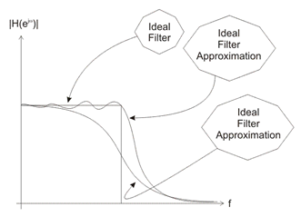
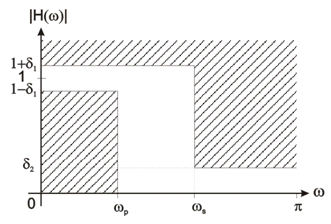
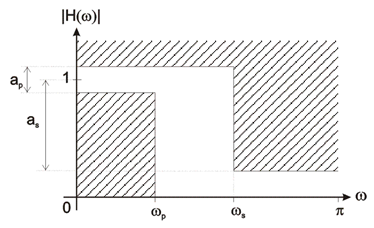
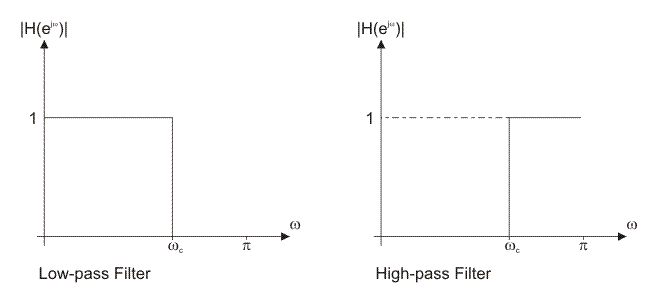

## Theory
                        

Finite Impulse Response (FIR) Filter

FIR filters are digital filters with finite impulse response. They are also known as non-recursive digital filters as 
they do not have the feedback (a recursive part of a filter), even though recursive algorithms can be used for FIR filter 
realization. Hence it is an all zero filter. Therefore input and output difference equation for FIR filter is given by

$$y(n)=b_0x(n)+b_1x(n-1)+b_2x(n-2)+...+b_(M-1)x(n-N+1)$$

Where b0, b1, b2 ... b(M-1) are filter coefficients. FIR filters are particularly useful for applications where exact 
linear phase response is required. The FIR filter is generally implemented in a non-recursive way which guarantees a 
stable filter.

FIR filters can be designed using different methods, but most of them are based on ideal filter approximation. The 
objective is not to achieve ideal characteristics, as it is impossible anyway, but to achieve sufficiently good 
characteristics of a filter. The transfer function of FIR filter approaches the ideal as the filter order increases, 
thus increasing the complexity and amount of time needed for processing input samples of a signal being filtered.

 
 Fig-1 

FIR filters can have linear phase characteristic, which is not like IIR filters. Obviously, in such cases when it is 
necessary to have a linear phase characteristic, FIR filters are the only option available. If the linear phase 
characteristic is not necessary, as is the case with processing speech signals, FIR filters are not good solution at all.

One of the drawbacks of FIR filters is a high order of designed filter. The order of FIR filter is remarkably higher 
compared to an IIR filter with the same frequency response. This is the reason why it is so important to use FIR filters 
only when the linear phase characteristic is very important.

A number of delay lines contained in a filter, i.e. a number of input samples that should be saved 
for the purpose of 
computing the output sample, determines the order of a filter. For example, if the filter is assumed to be of order 10, 
it means that it is necessary to save 10 input samples preceding the current sample. All eleven samples will affect the 
output sample of FIR filter

The transform function of a typical FIR filter can be expressed as a polynomial of a complex variable z^-1. All the poles 
of the transfer function are located at the origin. For this reason, FIR filters are guaranteed to be stable, whereas IIR 
filters have potential to become unstable

Basic concepts and FIR filter specification

Most FIR filter design methods are based on ideal filter approximation. The resulting filter approximates the 
ideal characteristic as the filter order increases, thus making the filter and its implementation more complex

First of all, it is necessary to learn the basic concepts that will be used further in this book. You should be aware 
that without being familiar with these concepts, it is not possible to understand analyses and synthesis of digital 
filters.

Figure 2.a and 2.b illustrates a low-pass digital filter specification. The word specification actually refers to the 
frequency response specification

 
   Figure 2.a: Low-pass digital filter specification

 
  Figure 2.b: Low-pass digital filter specification

 &omega;p normalized cut-off frequency in the passband;

 &omega;s normalized cut-off frequency in the stopband; 

&delta;1maximum ripples in the passband

&delta;2minimum attenuation in the stopband [dB]

ap maximum ripples in the passband; and

asminimum attenuation in the stopband [dB].
  
$$a_p=20log_{10}(\frac{1+\delta_1}{1-\delta_1})$$

$$a_s=-20log_{10}\delta_1$$

Frequency normalization can be expressed as follows: 

`omega=(2pif/f_s)`

where:

fsis a sampling frequency;
  

f is a frequency to normalize; and

 &omega; is normalized frequency.

Specifications for high-pass, band-pass and band-stop filters are defined almost the same way as those for low-pass filters.
Figure 3.a and 3.b illustrates a high-pass filter specification

 

Figure 3.b: High-pass digital filter specification

 

Figure 3.b: High-pass digital filter specification

Comparing these two figures 2.a, 2.b and 3.a, 3.b, it is obvious that low-pass and high-pass filters have similar 
specifications. The same values are defined in both cases with the difference that in the later case the pass band is 
substituted by the stop band and vice versa.

Finite impulse response (FIR) filter design methods

The filter design process starts with specifications and requirements of the desirable FIR filter. Which method is to be 
used in the filter design process depends on the filter specifications and implementation

There are essentially three well-known methods for FIR filter design namely:

1.The window method.

2.The frequency sampling technique.

3.Optimal filter design methods

Each of the given methods has its advantages and disadvantages. Thus, it is very important to carefully choose the right
method for FIR filter design. Due to its simplicity and efficiency, the window method is most commonly used method for 
designing filters. The sampling frequency method is easy to use, but filters designed this way have small attenuation in 
the stop band.

Out of these three techniques we are going to discuss about window method only

Ideal filter approximation

The ideal filter frequency response is used when designing FIR filters using window functions. The objective is to compute 
the ideal filter samples. FIR filters have finite impulse response, which means the ideal filter frequency sampling must 
be performed in a finite number of points. As the ideal filter frequency response is infinite, it is easy to produce 
sampling errors. The error is less as the filter order increases. Figure 4.a and 4.b illustrates the transfer functions of 
two standard ideal filters

 

 Figure 4.a and 4.b: Transfer functions of two standard ideal filters 

The ideal filter frequency response can be computed via inverse Fourier transform. The two standard ideal filters frequency
responses are contained in the table 1 below.

 

   Table 1: The frequency responses of two standard ideal filters

The value of variable n ranges between 0 and N, where N is the filter order. A constant M can be expressed as M = N / 2. 
Equivalently, N can be expressed as N = 2M

The constant M is an integer if the filter order N is even, which is not the case with odd order filters. If M is an 
integer (even filter order), the ideal filter frequency response is symmetric about its Mth sample which is found via 
expression shown in the table 1 above. If M is not an integer, the ideal filter frequency response is still symmetric, 
but not about some frequency response sample

Since the variable n ranges between 0 and N, the ideal filter frequency response has N+1 sample

If it is needed to find frequency response of a non-standard ideal filter, the expression for inverse Fourier transform 
must be used: 

`h_d[n]=1/pi int_(0)^(pi)e^(jomega(n-M))domega`

Non-standard filters are rarely used. However, if there is a need to use some of them, the integral above must be computed
via various numerical methods

FIR filter design using window functions

The FIR filter design process via window functions can be split into several steps:

1.Defining filter specifications;

2.Specifying a window function according to the filter specifications;

3.Computing the filter order required for a given set of specifications;

4.Computing the window function coefficients;

5.Computing the ideal filter coefficients according to the filter order;

6.Computing FIR filter coefficients according to the obtained window function and ideal filter coefficients

7.If the resulting filter has too wide or too narrow transition region, it is necessary to change the filter order by 
increasing or decreasing it according to needs, and after that steps 4, 5 and 6 are iterated as many times as needed

The final objective of defining filter specifications is to find the desired normalized frequencies , transition width and 
stopband attenuation. The window function and filter order are both specified according to these parameters. Accordingly,
the selected window function must satisfy the given specifications.

After this step, that is, when the window function is known, we can compute the filter order required for a given set of 
specifications.

When both the window function and filter order are known, it is possible to calculate the window function coefficients w[n]
using the formula for the specified window function

After estimating the window function coefficients, it is necessary to find the ideal filter frequency samples. The final
objective of this step is to obtain the coefficients hd[n]. Two sequences w[n] and hd[n] have the same number of elements.

The next step is to compute the frequency response of designed filter h[n] using the following expression:

`h[n]=w[n].h_d[n]`

Lastly, the transfer function of designed filter will be found by transforming impulse response via Fourier 
transform:

`H(e^(jomega))=sum_(n=0)^(N)h[n].e^(-jnomega)`

If the transition region of designed filter is wider than needed, it is necessary to increase the filter order, 
reestimate the window function coefficients and ideal filter frequency samples, multiply them in order to obtain 
the frequency response of designed filter and reestimate the transfer function as well. If the transition region is 
narrower than needed, the filter order can be decreased for the purpose of optimizing hardware and/or software resources. 
It is also necessary to reestimate the filter frequency coefficients after that. For the sake of precise estimates, the filter order should be decreased or increased by 1.

Window functions

The window method is most commonly used method for designing FIR filters. The simplicity of design process makes this 
method very popular.

A window is a finite array consisting of coefficients selected to satisfy the desirable requirements. This chapter provides 
a few methods for estimating coefficients and basic characteristics of the window itself as well as the result filters 
designed using these coefficients. The point is to find these coefficients denoted by w[n].

When designing digital FIR filters using window functions it is necessary to specify:

A window function to be used; and

The filter order according to the required specifications (selectivity and stop band attenuation).

These two requirements are interrelated. Each function is a kind of compromise between the two following requirements:

The higher the selectivity, i.e. the narrower the transition region; and

The higher suppression of undesirable spectrum, i.e. the higher the stop band attenuation.

Table 2 below contains all window functions mentioned in this chapter and briefly compares their selectivity and stop band 
attenuation

These two requirements are interrelated. Each function is a kind of compromise between the two following requirements:

The higher the selectivity, i.e. the narrower the transition region; and

The higher suppression of undesirable spectrum, i.e. the higher the stop band attenuation.

Table 2 below contains all window functions mentioned in this chapter and briefly compares their selectivity and stop band
attenuation.

Special attention should be paid to the fact that minimum attenuation of window function and that of the filter designed 
using that function are different in most cases. The difference, i.e. additional attenuation occurs under the process of 
designing a filter using window functions. This affects the stop band attenuation to become additionally higher, which is 
very desirable.

However, a drawback of this method is that the minimum stop band attenuation is fixed for each function. The following 
concepts such as the main lobe, main lobe width, side lobes, transition region, minimum stopband attenuation of window 
function and minimum stopband attenuation of designed filter are described in more detail in Figure 5

 

Figure 5: Main lobe, main lobe width, side lobes, transition region

As can be seen in the table 2 above, the stopband attenuation of these windows is not adjustable. It is only possible to
affect the transition region by increasing the filter order. For this reason it is preferable to start design process by 
specifying the appropriate window function on the basis of the stopband attenuation. It is most preferable to specify a 
window with the least stopband attenuation that satisfies the given requirements. This enables the designed filter to have 
the narrowest transition region

Frequency Response and Weight Values of different windows types
 

This image is taken from "http://www.labbookpages.co.uk/audio/firwindowing.html"

    
